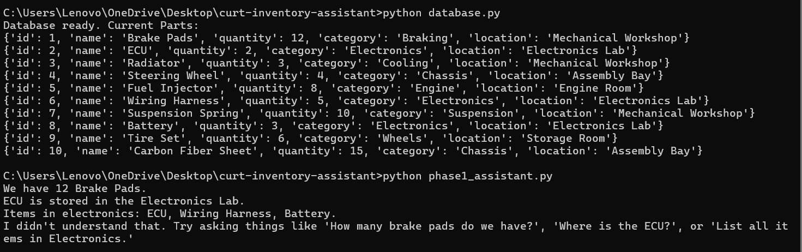
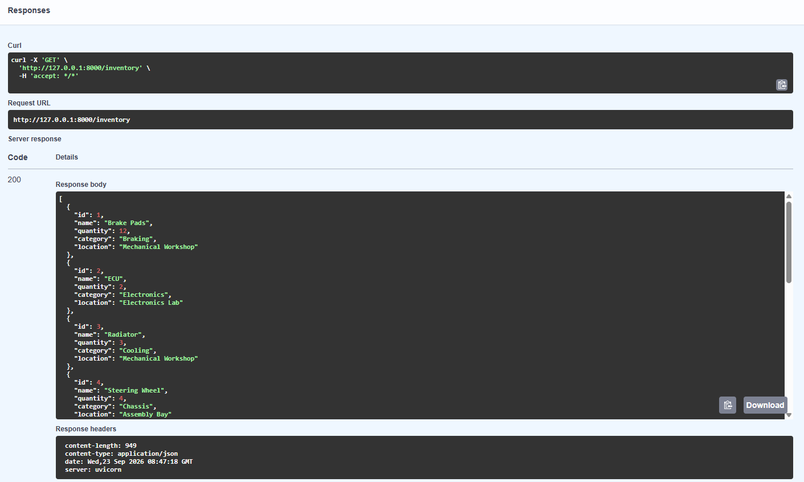
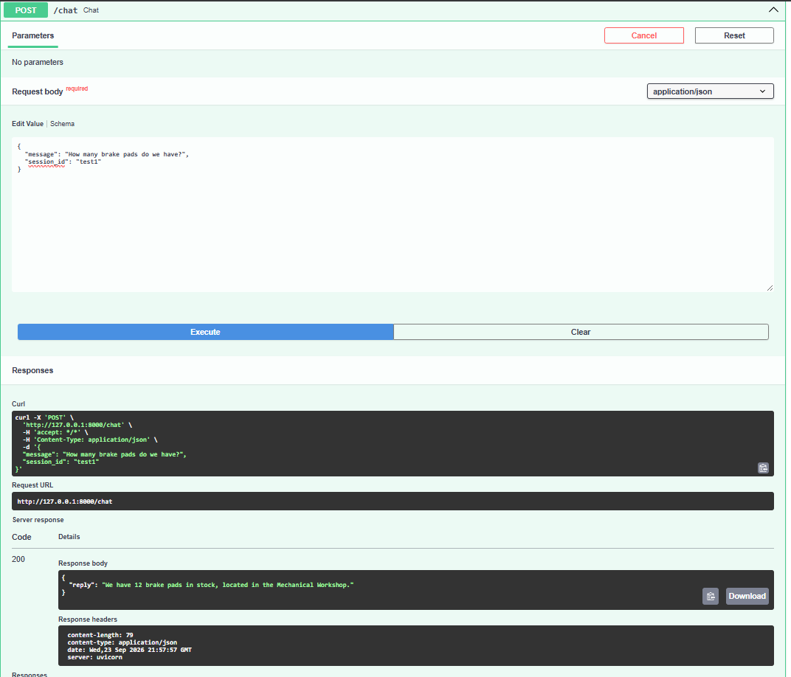
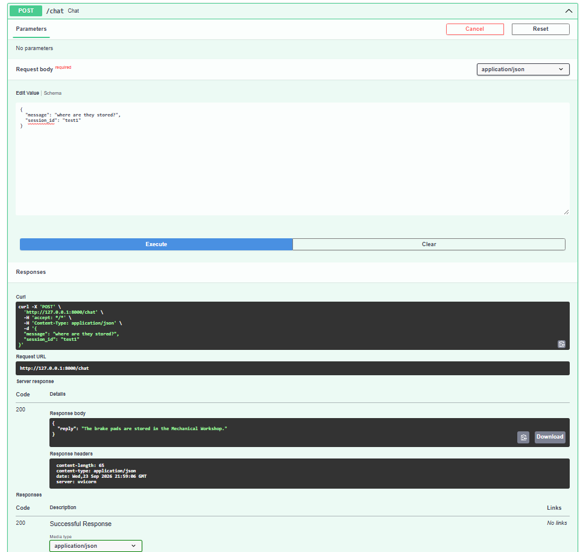
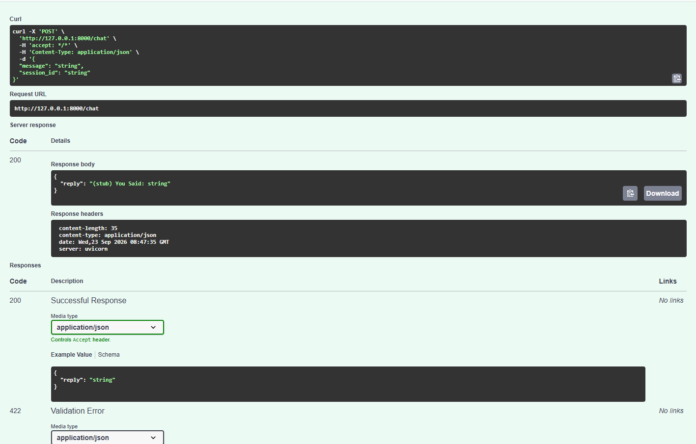
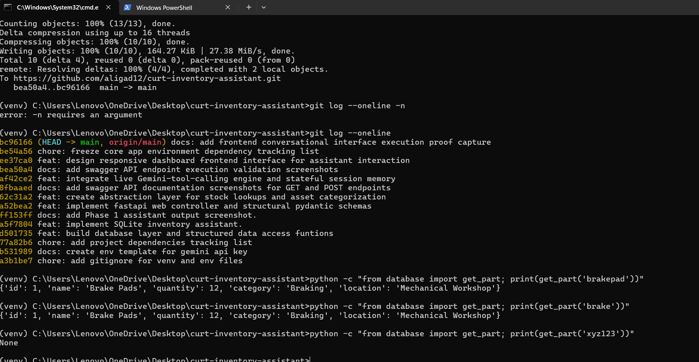
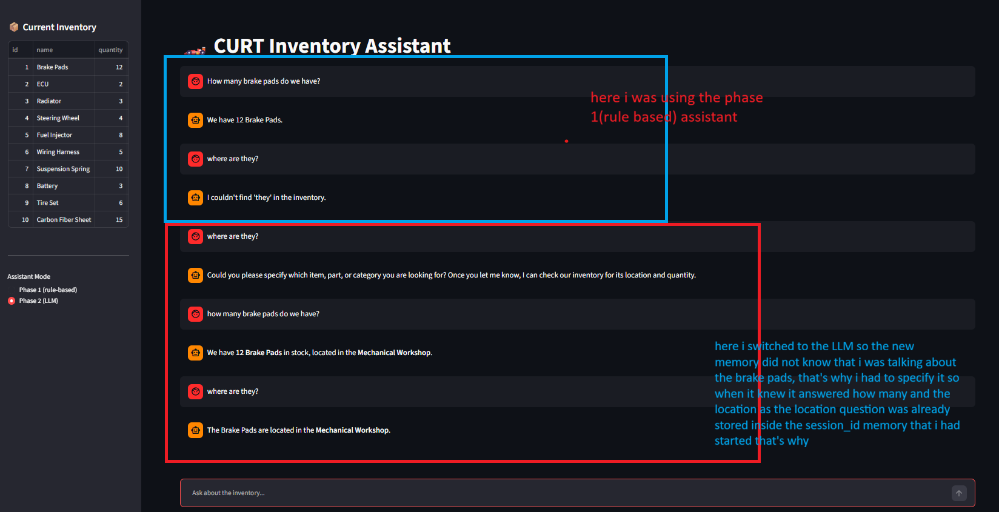
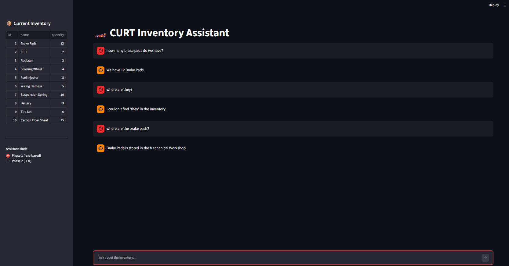
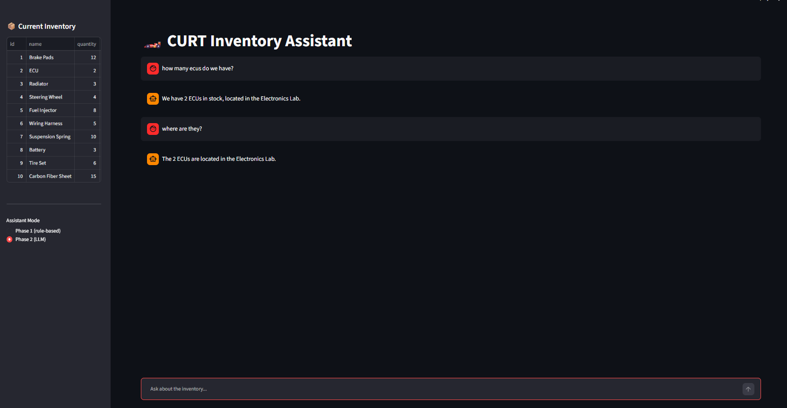

# CURT Inventory Assistant

A conversational assistant for the Cairo University Racing Team (CURT) parts inventory, built for the Generative AI Team technical task (Season 26-27). Team members can ask natural questions like *"How many brake pads do we have?"* or *"Where is the ECU stored?"* and get accurate answers pulled live from a real database.

The project is built in two stages:

- **Phase 1** — a rule-based assistant using keyword/regex matching, no AI model involved.
- **Phase 2** — the same assistant powered by a real LLM (Google Gemini) with function/tool calling, natural-language understanding, and multi-turn conversation memory.

Both phases read from the same live SQLite database, through a single shared data-access layer.

---

## Demo Screenshots

**Phase 1 — rule-based assistant**



**Phase 2 — LLM tool-calling, tested via FastAPI's Swagger UI**

`GET /inventory` returning the live database:



`POST /chat` — first turn, Gemini calls the `check_stock` tool:



`POST /chat` — follow-up turn in the same session, resolving "they" from conversation memory:



Swagger UI testing the `/chat` endpoint directly:



**Edge-case handling** — misspelled/partial item names and ambiguous questions:



**Streamlit frontend** — the full assistant UI with the Phase 1 / Phase 2 toggle:







---

## Project Architecture

```
┌─────────────────────┐
│  Streamlit Frontend  │  frontend_app.py
│  (chat UI + sidebar) │
└─────────┬────────────┘
          │
          ├── Phase 1 mode: direct Python import
          │
          └── Phase 2 mode: HTTP request
                       │
                       ▼
          ┌─────────────────────────┐
          │   FastAPI Backend        │  backend.py
          │   POST /chat             │
          │   GET  /inventory        │
          └─────────┬────────────────┘
                     │
                     ├── Phase 1: phase1_assistant.py (regex/keyword logic)
                     │
                     └── Phase 2: Gemini (tool-calling) ── tools.py
                                                              │
                                                              ▼
                                              ┌──────────────────────────┐
                                              │  database.py (Data Access │
                                              │  Layer — the ONLY code    │
                                              │  that touches SQL)        │
                                              └─────────────┬─────────────┘
                                                             ▼
                                              ┌──────────────────────────┐
                                              │   curt_inventory.db       │
                                              │   (SQLite)                │
                                              └──────────────────────────┘
```

The key design decision: **the LLM never sees SQL and never touches the database directly.** It can only call three pre-defined Python functions (`check_stock`, `list_by_category`, `flag_shortage`), each of which internally calls the same data-access layer that Phase 1 uses. This keeps a single source of truth for the data and a hard security boundary around it.

For a full deep-dive into our design decisions and architectural trade-offs, read our [Project Reflection](REFLECTION.md).


---

## Tech Stack & Why

| Tool | Role | Why this choice |
|---|---|---|
| **SQLite** | Database | Zero setup — a single file, built into Python's standard library. No server to install or configure, which fits a small, well-defined inventory table perfectly. The task doc lists it as the recommended default. |
| **FastAPI** | Backend API framework | Automatic request validation via Pydantic models, auto-generated interactive API docs (`/docs`), and native `async` support — all of which made testing the `/chat` and `/inventory` endpoints straightforward during development. |
| **Uvicorn** | ASGI server | The standard, lightweight server FastAPI apps run on. |
| **Streamlit** | Frontend | Lets a Python-only project ship a real, usable chat interface (with built-in chat bubbles, auto-scroll, and a sidebar) without writing any separate HTML/JS/CSS. |
| **Google Gemini (`gemini-3.6-flash`) via `google-genai` SDK** | LLM with function calling | Supports native tool/function calling required by the task, and offers a free tier suitable for a student project with a tight deadline. The SDK auto-generates tool schemas directly from Python function signatures and docstrings, minimizing hand-written boilerplate. |
| **python-dotenv** | Secrets management | Loads the Gemini API key from a local `.env` file so no key is ever hardcoded into source or committed to GitHub. |
| **`difflib` (standard library)** | Fuzzy matching | Handles misspelled/partial item names (e.g. "brakepad" → "Brake Pads") using built-in string-similarity scoring — no extra dependency needed for this. |
| **`requests`** | HTTP client (frontend → backend) | Lets the Streamlit app call the FastAPI `/chat` endpoint in Phase 2 mode. |

---

## Project Structure

```
curt-inventory-assistant/
├── .env                  # Real API key (never committed)
├── .env.example           # Placeholder — committed for reviewers
├── .gitignore
├── database.py             # DB setup, seeding, and the data-access layer
├── phase1_assistant.py    # Phase 1 rule-based logic
├── tools.py                # Phase 2 tool functions (check_stock, list_by_category, flag_shortage)
├── backend.py              # FastAPI app: /chat, /inventory, Gemini tool-calling
├── frontend_app.py         # Streamlit UI
├── requirements.txt
├── REFLECTION.md
├── README.md
└── assets/                  # Demo images referenced in this README
```

---

## Local Setup

### 1. Clone the repository
```bash
git clone <your-repo-url>
cd curt-inventory-assistant
```

### 2. Create and activate a virtual environment
```bash
python -m venv venv

# Windows
venv\Scripts\activate

# Mac/Linux
source venv/bin/activate
```

### 3. Install dependencies
```bash
pip install -r requirements.txt
```

### 4. Configure your environment
Copy the example env file and add your own Gemini API key (get one free at [aistudio.google.com/apikey](https://aistudio.google.com/apikey)):
```bash
cp .env.example .env
```
Then edit `.env`:
```
GEMINI_API_KEY=your_real_key_here
```

### 5. Initialize and seed the database
```bash
python database.py
```
This creates `curt_inventory.db` and seeds it with 10 sample parts if it's empty. Safe to re-run — it won't duplicate rows.

### 6. Run the backend (Terminal 1)
```bash
uvicorn backend:app --reload
```
API docs available at `http://127.0.0.1:8000/docs`.

### 7. Run the frontend (Terminal 2 — keep Terminal 1 running)
```bash
streamlit run frontend_app.py
```
Opens automatically in your browser.

---

## API Documentation

### `POST /chat`
Accepts a user message and session ID; routes it through Gemini with tool-calling enabled.

**Request:**
```json
{
  "message": "How many brake pads do we have?",
  "session_id": "test1"
}
```

**Response:**
```json
{
  "reply": "We have 12 brake pads in stock, located in the Mechanical Workshop."
}
```

Sending a follow-up with the **same `session_id`** retains conversation context:
```json
{
  "message": "where are they stored?",
  "session_id": "test1"
}
```
```json
{
  "reply": "The brake pads are stored in the Mechanical Workshop."
}
```

### `GET /inventory`
Returns the full current inventory as JSON, pulled live from the database.

**Response:**
```json
[
  {
    "id": 1,
    "name": "Brake Pads",
    "quantity": 12,
    "category": "Braking",
    "location": "Mechanical Workshop"
  },
  ...
]
```

---

## Tool-Calling Definitions (Phase 2)

These are the only functions the LLM is permitted to invoke. Each wraps the shared data-access layer in `database.py` — the model never writes or sees raw SQL.

| Tool | Parameters | Behavior |
|---|---|---|
| `check_stock` | `item_name: str` | Looks up quantity and location for a given part. Returns a "not found" result if no match exists. |
| `list_by_category` | `category: str` | Returns all items belonging to a given category. |
| `flag_shortage` | `item_name: str` | Logs a low-stock flag (printed/logged only — no real alerting system required by the task). |

The model decides which tool (if any) to call based on the user's natural-language question; the backend executes the real function and returns the result to the model, which then composes the final reply.

---

## Edge-Case Handling

The task intentionally leaves these decisions open. Here's what was implemented and why:

**1. Requested item does not exist**
Both phases return a clear "not found" message rather than failing silently or returning an empty/misleading result — so the user immediately knows to double-check the item name.

**2. Misspelled or partial item names**
`database.py`'s `find_closest_part()` uses `difflib.get_close_matches()` (similarity cutoff of `0.6`) as a fallback when an exact name lookup fails, plus a simple substring check for partial names (e.g. "brake" matching "Brake Pads"). The `0.6` cutoff is a deliberate tradeoff — loose enough to catch typos, tight enough to avoid incorrectly matching unrelated parts.

**3. Ambiguous or missing-information questions**
Rather than guessing, both phases are designed to signal that more information is needed:
- **Phase 1:** the regex patterns require an item/category to be present to match at all; a question like "how many do we have?" simply falls through to the general "I didn't understand that" fallback.
- **Phase 2:** the system instruction explicitly tells Gemini to ask a clarifying question rather than call a tool with incomplete information or guess at an answer.

See `REFLECTION.md` for the fuller reasoning behind these choices.

---

## Conversation Memory (Phase 2)

Each browser session generates a unique `session_id` (via `uuid.uuid4()` in the Streamlit app). The backend keeps a per-session Gemini chat object in an in-memory dictionary, so follow-up questions ("where are *they* stored?") correctly resolve against the prior turn. This memory is in-process only — it resets if the backend restarts, as permitted by the task ("no persistence required").

---

## Reflection

See [`REFLECTION.md`](REFLECTION.md) for a full writeup of the edge-case reasoning and what would be improved with more time.

---

## Security Notes

- No API keys are hardcoded anywhere in source code.
- The real `.env` file is excluded via `.gitignore` and never committed; `.env.example` (placeholder only) is committed instead.
- The LLM has no direct database access — all data access goes through the controlled functions in `tools.py` → `database.py`.

---

## Author

Built by Ali — Systems & Biomedical Engineering, Cairo University — for the CURT Generative AI Team technical task, Season 26-27.